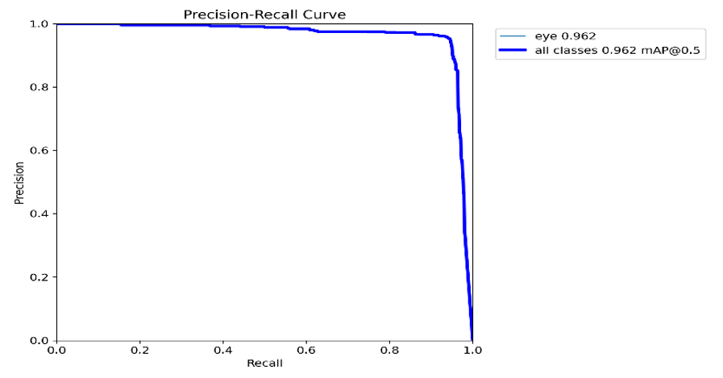
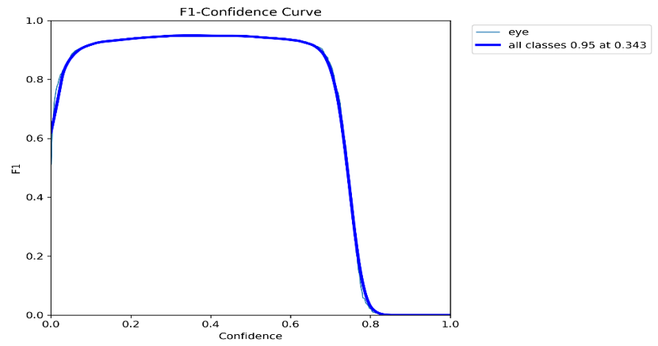
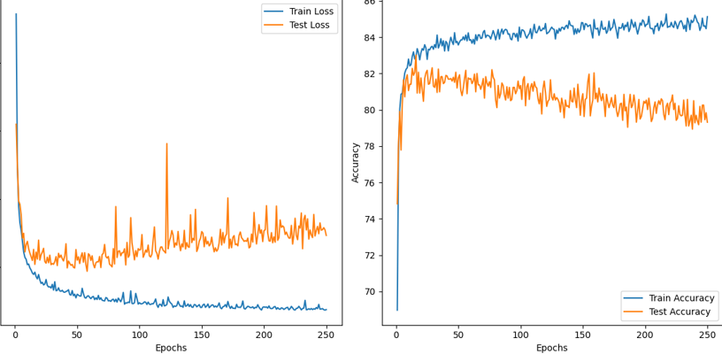
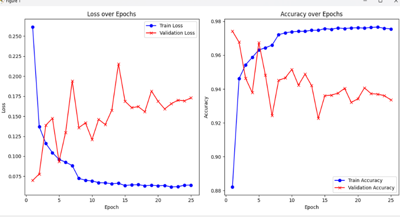
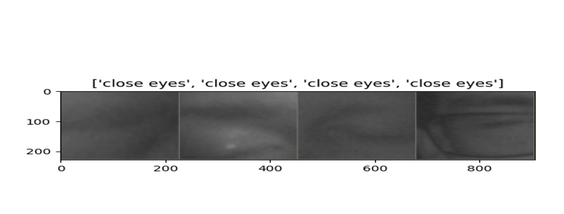
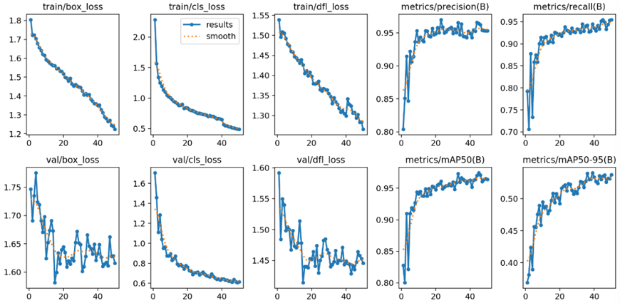
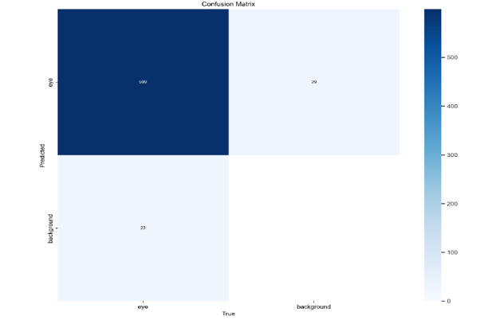
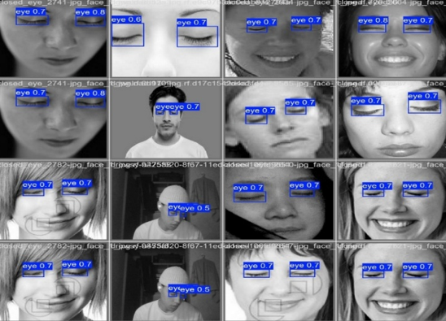

# DriveSense: AI-Based Real-Time Drowsiness Detection System

**Please contact me for source files**

## Project Purpose  
Driver drowsiness is a major cause of traffic accidents. This project aims to detect driver fatigue signs in real time using AI and computer vision to improve road safety.

Demo Video: https://www.linkedin.com/feed/update/urn:li:activity:7315650463918436354/

!(images/)  

## Technical Features

- Real-time video processing with OpenCV  
- Face, eye, and head position detection via YOLOv11  
- Drowsiness classification using TensorFlow CNN models  
- FastAPI backend for fast, low-latency processing  
- Ngrok for public backend access  
- React frontend for real-time alerts and status display  
- Immediate visual and audio alerts upon detecting drowsiness  

## Technologies Used

| Technology | Role                                              |
|------------|---------------------------------------------------|
| OpenCV     | Video capture and preprocessing                    |
| YOLOv11    | Object detection (face, eyes, head)                |
| TensorFlow | Model training and inference                        |
| FastAPI    | Backend API development                             |
| Ngrok      | Public tunneling for local backend                  |
| React      | Web-based user interface                            |

## System Architecture and Workflow

1. Capture live video feed using OpenCV.  
2. Detect face, eyes, and head position with YOLOv11.  
3. Feed detections into TensorFlow model to classify drowsiness.  
4. Backend (FastAPI) sends alert status to frontend.  
5. React frontend provides visual and audio alerts to driver.

## Model and Training Data

- Dataset consists of driver face and eye images under various conditions.  
- Model trained on blink frequency, eye closure duration, and head tilt.  
- High accuracy and low error rates achieved (see figures below).

## 📊 Model Performance and Training Results

### Figure 1: Precision Graph  
Shows the accuracy of positive drowsiness detections, indicating low false positives.  

### Figure 2: F1-Score Graph  
Reflects the balance between precision and recall, indicating overall detection performance.  

### Figure 3:  
a) First Training Loss Graph – Shows decreasing loss during initial training phase.  
b) First Training Accuracy Graph – Shows increasing accuracy during initial training.  
  

### Figure 4:  
a) Second Training Loss Graph – Loss trend in second training phase.  
b) Second Training Accuracy Graph – Accuracy improvement in second phase.  
  

### Figure 5: Model Predictions on Test Data  
Demonstrates model’s prediction capability on unseen driver images.  

### Figure 6: YOLO Model Loss Functions and Evaluation Metrics  
Training loss curves and performance metrics (e.g. mAP, IoU) for YOLOv11.  

### Figure 7: YOLO Confusion Matrix  
Displays classification performance details with true/false positives and negatives.  

### Figure 8: YOLO Detections and Confidence Scores on Test Data  
Visualizes detected objects and confidence levels for face and eye detection.  

## Future Improvements

- Improve detection under low-light conditions  
- Add yawning and head nodding detection  
- Support multi-camera input and cross-validation  

## Contact

**Görkem Turkut**  
Email: gorkemturkut@hotmail.com

GitHub: [gorkemturkut57](https://github.com/gorkemturkut57) 

LinkedIn: [Görkem Turkut](https://www.linkedin.com/in/gorkemturkut)

---

## License

MIT License – see the `LICENSE` file for details.
